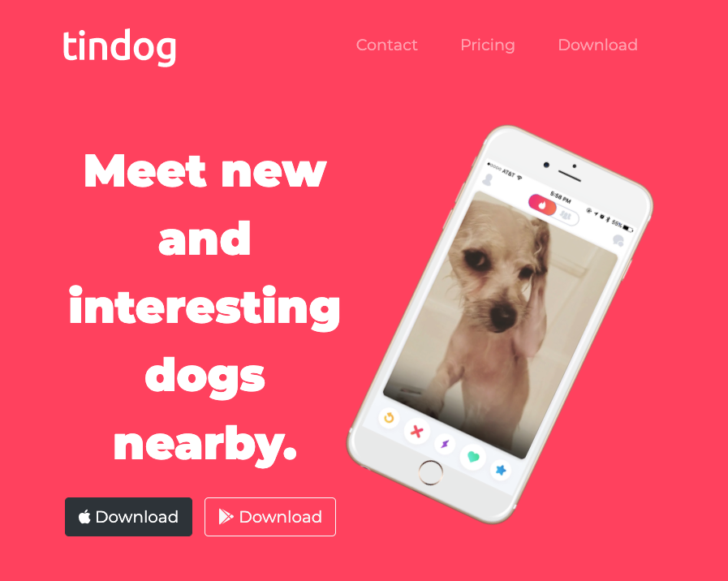

# Tindog

## Description

This is the landing page of a fictional startup company called Tindog and can be viewed both on desktop and mobile. The landing page clearly displays the branding of the company, the services the company offers, and some customer testimonials. 

## Table of Contents

* [Description](#description)
* [Technology](#technology)
* [User Story](#user-story)
* [Installation](#installation)
* [Usage](#usage)
* [License](#license)
* [Contributing](#contributing)
* [Tests](#tests)
* [Questions](#questions)
* [Deployed Application URL](#deployed-application-URL)

## Technology

- HTML
- CSS
- Bootstrap

## User Story

As a CEO of a startup I WANT a responsive modern and eye catching website SO THAT customers can view the services that we offer.

## Installation

No installation needed.

## Usage

The deployed application link will take you to the homepage. 

## License

## Contributing

Please follow standard contributing guidelines.

## Tests

No tests to run.

## Questions

For any questions, please contact kendayao at kendayao@gmail.com

## Deployed Application URL

Deployed application link: https://kendayao.github.io/Tindog/

Video demo link: https://giphy.com/gifs/jR4z6OjgnmXslEzgqg/fullscreen

